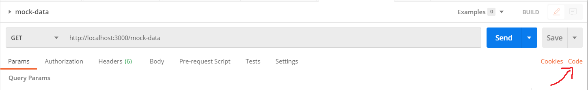

Table of Contents

- [What is express](#what-is-express)
- [Prerequisites required for running express](#prerequisites-required-for-running-express)
- [Creating a simple express project](#creating-a-simple-express-project)
- [Creating a simple express app](#creating-a-simple-express-app)
  - [Adding dev dependencies](#adding-dev-dependencies)
- [Creating simple routes in server](#creating-simple-routes-in-server)
- [Responding with JSON](#responding-with-json)
- [Providing static files as response](#providing-static-files-as-response)

## What is express

Express is a minimal and flexible Node.js web application framework that provides a robust set of features for web and mobile applications.

Express provides a myriad of HTTP utility methods and middleware at your disposal, creating a robust API is quick and easy.

Express provides a thin layer of fundamental web application features, without obscuring Node.js existing features.

Other than this many other web frameworks are build over express.

## Prerequisites required for running express

- Install nodejs, install using an msi downloaded from nodejs website.
  - To check if node is installed properly `node --version`.
- install Express app generator globally using command `npm install -g express-generator`.
  - To verify use command `express -h`.

## Creating a simple express project

Use command `express --view=hbs`, this will create a basic structure of express project which will support handlebars for exceptions and other basic things required.

> A new folder sample-app is created and following steps are performed after navigating to the same path.

- Install dependencies `npm install`.
- To start app `npm start`.
- By default application starts on port 3000. Navigate to any browser and launch `http://localhost:3000/`. You should be able to see **Welcome to express** on screen.
- To stop application `ctrl+c` and choose y.

## Creating a simple express app

- Create a folder express app and navigate to it
- Initiate it as a npm project using `npm init`, proceed with defaults.
- install express and node-mon as dependencies using command `npm install express nodemon`.
  > Nodemon will load the updated code to server when ever we make modifications to code, instead of starting and stopping it again and again.
- Express and nodemon will be added to package.json

### Adding dev dependencies

- To convert es6 or future versions of javascript we need a compiler, babel is used in this project to do so.
- install the following dev dependencies
  - babel-cli
  - babel-preset-ent
  - babel-preset-stage-0
- use command `npm install --save-dev babel-cli babel-preset-env babel-preset-stage-0`
- Configure babel with '.babelrc' file adding the presets to it as shown below
  ```{
    "presets":[
        "env",
        "stage-0"
    ]
  }
  ```
- Add a start script for starting the application in package.json under scripts
  ```javascript
  "start": "nodemon ./index.js --exec babel-node -e js"
  ```
- Add an index.js file, which will be an entry point for the application
- Import express and start app on port 3000

```Javascript
import express from 'express';

const app = express();
const _PORT = 3000;

app.listen((_PORT)=> {
    console.log('Server listening on port: ' + _PORT);
});
```

## Creating simple routes in server

- The basic http server calls that we do are
  - GET : Generally used to retrieve data
  - POST : To add data
  - PUT : To update data
  - DELETE : To delete data
- We can create routes for this from the default express function

| HTTP Method | Express Function | Example                                                                   |
| ----------- | ---------------- | ------------------------------------------------------------------------- |
| GET         | app.get          | app.get("/", (req, res)=>{ res.send("Get call response");});              |
| POST        | app.post         | app.post("/post", (req, res) => {res.send("POST call response");});       |
| PUT         | app.put          | app.put("/put", (req, res) => {res.send("PUT call response");});          |
| DELETE      | app.delete       | app.delete("/delete", (req, res) => {res.send("DELETE call response");}); |

- Get call can be tested from browser as there will not be any request body in maximum cases.
- To test the other scenarios, we need to use a test suite like postman or soap ui
- sample postman collection for the same is attached to this project at location express-app >> postman-collection

## Responding with JSON

- The requests can be responded with JSON data, create a mock data
- Got to [Mockaroo](https://www.mockaroo.com/) to generate mock data.
- Enter the name fields, enter how many rows of data you need, select format of data generally preferred as json.
- Click download data button an it will provide a file with mock data.
- Place the data in a folder inside the express-app
- import it as `import data from './data/data.json';`.
- To send this data as response we can do it as follows.

```Javascript
app.get("/mock-data", (req, res) => {
  res.json(data);
});

//<<server:port>>/mock-data will return the json as response
```

> Postman can provide code snippets for calling a url, click on the code button to see the snippets
> 

## Providing static files as response

- With express we can provide static files as response we need to use the `express.static` function
- Create a public and resources folders in express app
- Add `app.use(express.static("public"));` in index.js
  - By adding the above line everything in public folder is accessible with name
  - example `http://localhost:3000/binary-vortex.png` will give the 'binary-vortex.png' image
- Add `app.use("/resources", express.static("resources")); ` in index.js
  - By adding the above line the files in resources folder will be accessible on uri /resources
  - example `http://localhost:3000/resources/binary-silhouette.jpg` will give 'binary-silhouette.jpg' image.
